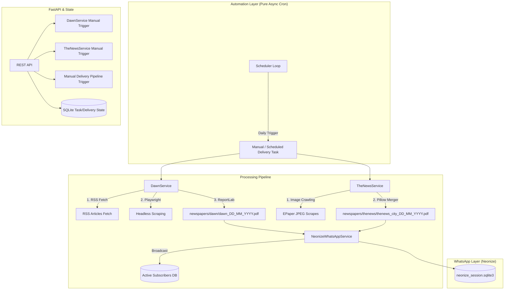

# NewsPapersHub — Automated Newspaper Generation & Delivery Pipeline

> **RSS scraping · Headless browser extraction · PDF rendering · WhatsApp Broadcast · Automated Cron**

Pakistani news publishers don't expose clean APIs. Getting a structured, readable edition of **Dawn** or **The News International** requires stitching together RSS feeds, content extraction from JavaScript-rendered pages, and deterministic multi-column PDF layout.

**NewsPapersHub** automates this entire lifecycle:
1. **Generation:** Scrapes and renders a production-grade A3 newspaper PDF.
2. **Delivery:** Automatically broadcasts the PDF to active subscribers via WhatsApp.
3. **Automation:** Runs daily on a configurable pure-async scheduler.

---

## 🏗️ System Architecture



---

## 🚀 Tech Stack

| Layer | Technology | Role |
|---|---|---|
| **API** | FastAPI + Uvicorn | Async REST + SSE streaming server |
| **Automation** | Asyncio Scheduler | Daily automated generation & delivery loop |
| **WhatsApp** | Neonize | Pure-Python whatsmeow bindings for WhatsApp broadcast |
| **Scraping** | Playwright (Chromium) | High-performance async headless extraction (Dawn) |
| **Parsing** | BeautifulSoup4 | Structured content extraction |
| **PDF Rendering** | ReportLab | Programmatic A3 newspaper layout |
| **Pillow (PIL)** | Pillow | ePaper scanned image merging into high-res PDF (The News) |
| **Persistence** | SQLite + SQLAlchemy | Persistent subscriber and task tracking |
| **Database Migrations**| Alembic | Reliable SQLite database schema migrations |
| **Validation** | Pydantic v2 | Strict request/response schema enforcement |
| **Dependency Manager**| `uv` | Lightning-fast Python package installer and lock management |

---

## 🛠️ Key Engineering Features

### 1. Hybrid Execution Model (I/O vs CPU)
To prevent "blocking the loop" and maintaining low-latency REST endpoints and Server-Sent Event (SSE) streams, the system separates tasks:
- **Async I/O**: Network requests (Playwright, Feed fetching) and WhatsApp message dispatch run on the main event loop.
- **Threaded CPU**: Heavy computation like BeautifulSoup parsing, Pillow image conversion, and ReportLab A3 PDF generation are offloaded to a `ThreadPoolExecutor` using `asyncio.run_in_executor`.

### 2. Native WhatsApp Integration (Neonize)
Instead of relying on heavy Node.js bridges or paid APIs, the system uses **Neonize** (Python bindings for the `whatsmeow` Go library). 
- Requires only a one-time QR scan.
- Session persists in a lightweight SQLite file.
- Automates direct PDF document broadcast to subscribers.

### 3. Stateful Task Tracker & SQLite Persistence
Redundant in-memory stores have been replaced with a reliable SQLite backend powered by SQLAlchemy.
- Tracks exact state transitions (`pending` ➔ `discovering` ➔ `downloading` ➔ `building_pdf` ➔ `completed` / `error`).
- Stores a persistent record of active subscribers (managed through custom subscriber endpoints).
- Session tracking and task logs survive application and system restarts.

### 4. Idempotent Scheduler
The built-in scheduler checks a configurable time window (e.g., 7 PM - Midnight). It stores a `whatsapp_sent` flag in the SQLite database to ensure the daily paper is generated and delivered **exactly once**, safely ignoring process restarts or overlapping cron windows.

### 5. Time-Aware Personalized Greetings
All newspaper dispatch templates automatically adapt their salutation dynamically based on the execution hour of the system. Instead of hardcoded generic headers, subscribers receive `"Good morning"`, `"Good afternoon"`, `"Good evening"`, or `"Hello"` to perfectly match when the paper actually arrives.

### 6. Production-Grade Structured Rotating Logs & Developer CLI
- **Global Structured Logging:** The system has been completely retrofitted with `structlog`. All codebase logs automatically output clean, aligned color tags to `stdout` and standardized JSON objects to `logs/newspapershub.log`.
- **Timed File Rotation:** Log files rotate daily (`when="D"`) and automatically clean up to retain only the last **3 days** of backup logs, preventing disk overflow.
- **Global `newshub-logs` CLI:** Running `newshub-logs [count]` anywhere in the terminal instantly parses the JSON logs and prints a beautifully colorized developer log stream in real-time.

---

## 🐳 Containerized Deployment (Docker & Compose)

NewsPapersHub comes fully dockerized with a clean **Supervisor** orchestration layer to run both the FastAPI REST server and the background scheduler side-by-side inside a single lightweight container.

> [!TIP]
> For a comprehensive, step-by-step production setup manual detailing volumes, inner process status tracking, and Docker CLI commands, please check our [Complete Docker Deployment Guide](file:///home/my-pc/Desktop/Programming/CodeKonix/Projects/NewsPapersHub/docs/docker_guide.md).

### 1. Start the System
```bash
docker compose up -d --build
```

### 2. Check the Logs (Required to scan the WhatsApp QR code on first startup)
```bash
docker compose logs -f newspapershub
```

### 3. Persisted Data
The SQLite databases, task tracking database, and WhatsApp Neonize auth session are persisted locally inside the `./db` directory, which is automatically mounted as a volume.

---

## ⚡ Makefile Shortcuts

A convenient `Makefile` is provided to simplify daily operations:

| Command | Action |
|---|---|
| `make start` | Builds and runs the Docker Compose services in detached mode. |
| `make stop` | Stops the running Docker Compose containers. |
| `make logs` | Follows stdout/stderr logs (ideal for scanning the QR code). |
| `make reset-whatsapp` | Wipes the current WhatsApp session and restarts the container to generate a fresh QR code. |

---

## 🏃 Local Quick Start

### 1. Installation
The project uses `uv` for lightning-fast dependency management.

```bash
# Install dependencies
uv sync

# Install Playwright Chromium binary and its dependencies
uv run playwright install chromium --with-deps
```

### 2. Run Database Migrations
Initialize or upgrade your SQLite schema using Alembic:
```bash
uv run alembic upgrade head
```

### 3. Environment Configuration
Copy the example env file and configure your secrets:
```bash
cp .env.example .env
```
Minimal required `.env`:
```env
APP_API_KEY=your_secret_api_key_here
NEONIZE_SESSION_PATH=./db/neonize_session.sqlite3
```
All other application settings (scheduler windows, timeouts, RSS feeds) are maintained cleanly in `app/core/config.py`.

### 4. WhatsApp Authentication (One-Time Link)
Before the scheduler can send messages, you must link your WhatsApp account. Simply run our custom global command from anywhere in the terminal:
```bash
newshub-auth
```
A QR code will generate in your terminal. Scan it using your mobile WhatsApp app (**Settings ➔ Linked Devices ➔ Link a Device**). 

Once linked, press `Ctrl+C` to close the stream. The session persists securely inside `db/neonize_session.sqlite3` and is shared automatically across both local runs and Docker containers!

### 5. Run the Application Locally
You can run the FastAPI server and the background scheduler separately:
```bash
# Terminal 1: Run the API server
uv run uvicorn app.main:app --host 0.0.0.0 --port 8000

# Terminal 2: Run the automated scheduler
uv run python -m app.services.scheduler_service
```

### 6. View Colored Structured Logs
All service events are logged as structured JSON objects in `logs/newspapershub.log`. To tail and parse them in real-time in a beautiful colorized terminal format from anywhere:
```bash
# View the latest 15 logs
newshub-logs

# Or view a custom number of lines (e.g. 30 logs)
newshub-logs 30
```

---

## 📡 API Reference

*Note: All endpoints require the `Authorization: Bearer <APP_API_KEY>` header.*

### 1. Manual Generation & Delivery
#### `POST /api/v1/deliver/{date}`
Manually trigger the generation and broadcast of newspapers for a specific date.
- **Path Param:** `date` (format: `YYYY-MM-DD`)
- **Query Param:** `papers` (optional list, e.g. `?papers=dawn&papers=thenews`)
- **Response:** `{"status": "success", "message": "..."}`

#### `GET /api/v1/dawn/{date}`
Start Dawn PDF generation. Returns immediately.
- **Response:** `TaskProgressResponse` shape.

#### `GET /api/v1/thenews/{date}`
Start The News PDF download. Supports concurrent multi-city generation.
- **Query Param:** `city` (optional, repeatable — `islamabad` · `karachi` · `lahore` · `peshawar`)
- **Response:** `TaskProgressResponse` shape.

---

### 2. Real-Time Tracking
#### `GET /api/v1/stream/{task_id}`
**Server-Sent Events (SSE)** endpoint. Streams progress updates as they happen and closes automatically when the task reaches a terminal state (`completed` or `error`).
- **Data format:** JSON string following the `TaskProgressResponse` schema.

---

### 3. WhatsApp & Subscribers Management
#### `GET /api/v1/subscribers/`
List all registered subscribers in the system.

#### `POST /api/v1/subscribers/`
Add a new subscriber.
- **Body:**
  ```json
  {
    "phone_number": "+923001234567",
    "full_name": "Hammad Munir",
    "is_active": 1
  }
  ```

#### `GET /api/v1/subscribers/{id}`
Retrieve a specific subscriber by ID.

#### `PUT /api/v1/subscribers/{id}`
Update subscriber details (phone, name, active status).

#### `DELETE /api/v1/subscribers/{id}`
Remove a subscriber from the broadcast list.

#### `POST /api/v1/whatsapp/send-media`
Send a generated PDF to a specific phone number.
- **Body:**
  ```json
  {
    "to": "+923001234567",
    "media_path": "newspapers/dawn/dawn_17_05_2026.pdf",
    "caption": "Here is your copy!"
  }
  ```

#### `POST /api/v1/whatsapp/broadcast`
Broadcast a PDF to all active subscribers.
- **Body:**
  ```json
  {
    "media_path": "newspapers/dawn/dawn_17_05_2026.pdf",
    "text": "📰 Good morning {name}! Here is your newspaper."
  }
  ```

---

## ⚙️ Configuration Settings

Key operational configurations in `app/core/config.py` can be set as env variables or modified directly:
- `SCHEDULER_WINDOW_START` (default: `19` ➔ 7 PM): Delivery window start hour.
- `SCHEDULER_WINDOW_END` (default: `24` ➔ Midnight): Delivery window end hour.
- `SCHEDULER_INTERVAL_MIN` (default: `30` minutes): Check frequency.
- `NEONIZE_SESSION_PATH` (default: `db/neonize_session.sqlite3`): Location of WhatsApp session sqlite db.

---

**Author:** Hammad Munir · [github.com/hammadmunir959](https://github.com/hammadmunir959)
